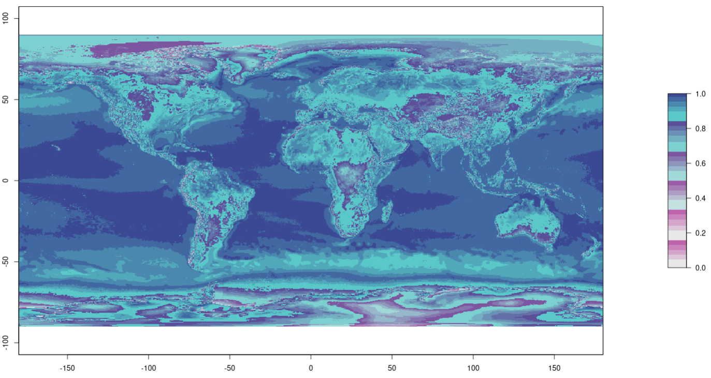
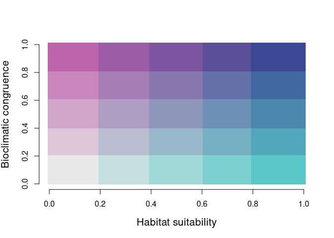
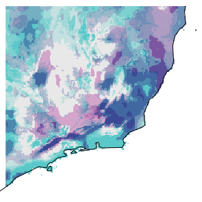
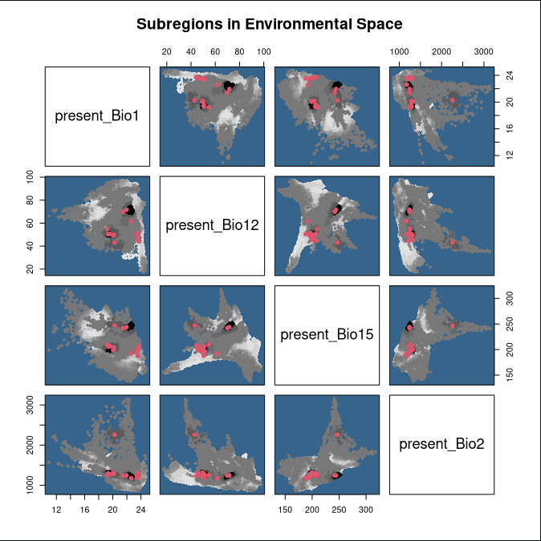
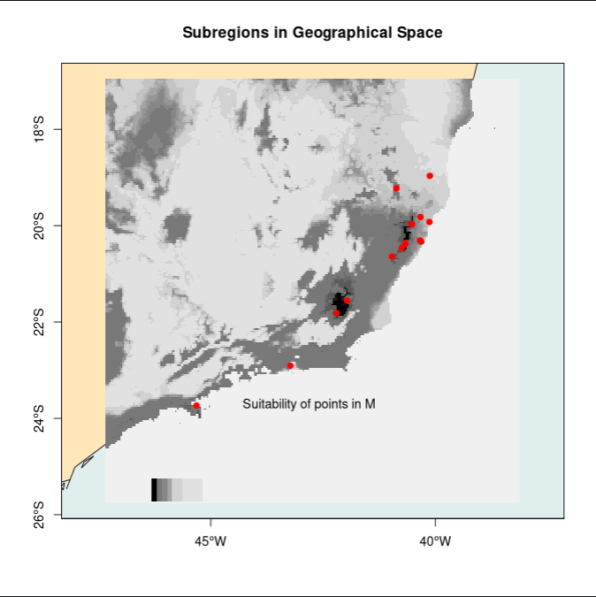
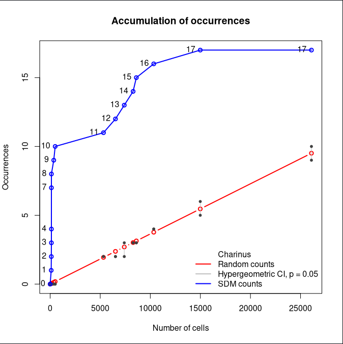
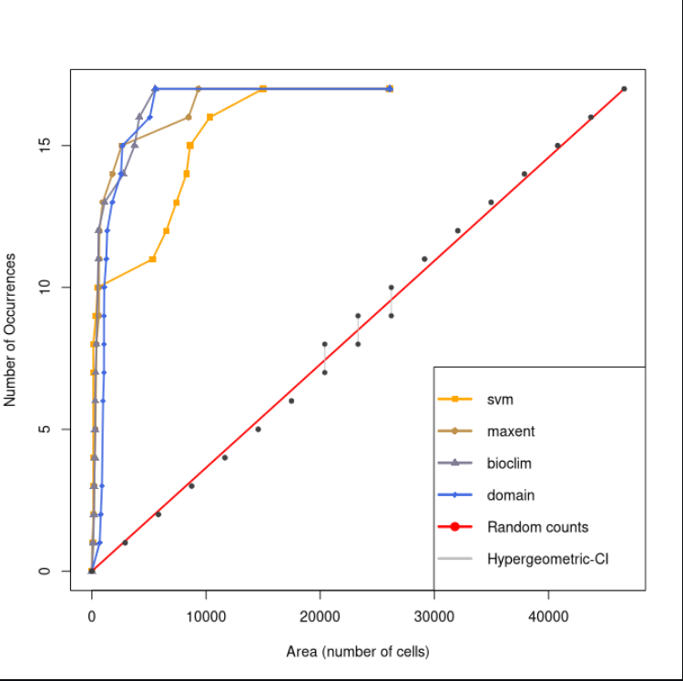

<!-- README.md is generated from README.Rmd. Please edit that file -->

```{r, include = FALSE}
knitr::opts_chunk$set(
  collapse = TRUE,
  eval = FALSE,
  comment = "#>",
  fig.path = "man/figures/README-",
  out.width = "100%"
)
```

# sdmTools
## Author: João Frederico Berner

<!-- badges: start -->
[](https://github.com/jfberner/jfbpack/actions/workflows/R-CMD-check.yaml)
<!-- badges: end -->

Have any suggestions? Contact me on [Twitter](twitter.com/bernerfrederico) :)

### Outline
- [Introduction](#introduction)
- [Installation](#installation)
- [Examples](#examples)
- [Base Objetcs For This Tutorial](#base-objects)
- [Boyce Index](#boyce-index)
- [Congruence Maps](#congruence-maps)
- [Accumulation of Occurrences Curve](#accumulation-of-occurrences-curve)
- [Ensemble by Frequency](#ensemble-by-frequency)

## Introduction

The goal of sdmTools is to allow easy implementation of methods not implemented in the sdm package, using the standard outputs of the sdm:: functions. The methods are all described in the literature, and are usually not compiled in any single package, which leads to very long coding and implementing sessions. The author felt ENM analyses and mapping currently sparsed in the literature could be centralized in a single package.

There are four currently working "branches/tools" in the package. Namely, 

 1. **Boyce Index** [[@hirzelEvaluatingAbilityHabitat2006]](https://doi.org/10.1016/j.ecolmodel.2006.05.017) , with the function `sdm_to_boyceIndex()`;
 2. **Consistency/Congruence Maps** [[@morales-barberoInputMattersMatter2019a]](https://doi.org/10.1111/2041-210X.13124) with the function  `sdm_to_consistency()`. [Original source code here](https://besjournals.onlinelibrary.wiley.com/action/downloadSupplement?doi=10.1111%2F2041-210X.13124&file=mee313124-sup-0002-AppendixB_Rcode.R). I intend to allow new congruence maps to be created from a set of environmental predictors with a new function in the near future, but for now only the [original congruence map](https://doi.org/10.5061/dryad.6kv7k29) is available, which was built using [WorldClim v.2](www.worldclim.org/version2), 
 MERRAclim [@c.vegaMERRAclimHighresolutionGlobal2017], 
 [CHELSA](www.chelsa-climate.org),
 ocean databases [MARSPEC](www.marspec.org)
 and [Bio-ORACLE v. 2.0](www.bio-oracle.org). See [@morales-barberoInputMattersMatter2019a](https://doi.org/10.1111/2041-210X.13124) for details.
 3. **Accumulation of Occurrences Curve** [[@jimenezLeavingAreaReceiving2020a]](https://doi.org/10.1111/2041-210X.13479) with the functions `sdm_to_occ.pnts()` and `sdm_to_output.mods()`, to be passed onto the [original functions](https://github.com/LauraJim/SDM-hyperTest) 
 `accum.occ()`, and later `comp.accplot()`, originally found at: [](https://doi.org/10.5281/zenodo.3981453).
 4. **Frequency Ensemble** [[@sobral-souzaSpeciesExtinctionRisk2015]](https://doi.org/10.1016/j.ncon.2015.11.009) with functions `sdm_to_freqEnsemble()` and `frequency_ensemble_plot()`. The approach is the same as in the paper, but the code I got from a class I had with one of the authors.

Below, I do my best to explain when/why use each of these and give examples of usage with the standard outputs from the sdm package, mainly from sdm() and predict().

## Installation

You can install the development version of sdmTools from [GitHub](https://github.com/) with:

``` r
# install.packages("devtools")
devtools::install_github("jfberner/sdmTools")
```

## Examples

### Base Objects

###### Disclaimer

- The following are the basic objects that are going to be used in all the examples. They are not meant to be fully reproducible, as species data, variable and algorithm selection vary considerably and should be picked according to each dataset and objectives. Instead, I intend to briefly take the reader through the process of creating an ENM with the sdm package solely for clarifying what each object is (or is supposed to be).

- Details on the nature and origin of the datasets should not be important for the use of this package's functions. 

- Mind that some lines of the code are a MUST if one's to implement my functions, and they are described as such.

The **'species'** I'm using here is going to be called 'charinus'. It is not a species, but is a model from another project I have easy at hand. I will not be sharing the dataset. I have two datasets: one called `occ_train` (with model training data) and another called `occ_test` (with model test data, which includes absence records). These objects are SpatialPointsDataFrame(s).

```{r echo=T, eval=T, results='hide'}
# The following are shapefiles (.shp) being loaded:
occ_train <- rgdal::readOGR('data/processed/shapefiles/train.shp')
occ_test <- rgdal::readOGR('data/processed/shapefiles/test.shp')
```

```{r eval=T}
# As SpatialPointsDataFrame
class(occ_train)
```

**Climate Data** (predictors) are four uncorrelated bioclimatic variables from [BioClim v2.1](https://www.worldclim.org). In the code they'll be called `envpres`, refferring to 'present' climate (average from 1970-2000, more on this on worldclim's website linked above).

```{r echo=T, eval=T, results='hide', warning=FALSE}
envpres <- dir(path = 'data/processed/envcropped/Present/', pattern = ".tif$", full.names = T)

envpres <- raster::stack(envpres)
```

```{r eval=T}
class(envpres)
```

I'll be using four **algorithms** in my all of the examples: SVM, MaxEnt, BioClim and Domain. References for those can be found in [e.g. @sobral-souzaSpeciesExtinctionRisk2015](https://doi.org/10.1016/j.ncon.2015.11.009), I will not go into details here.

```{r echo=T, eval=T, results='hide'}
# Saving algorithm list can make life easier, for at least a couple reasons: 
# it retains the order in which they are modeled inside the sdm::sdm() function to be used in sdmTools functions, 
# and it saves you from re-typing them everytime.

algorithms <- c('svm', 'maxent', 'bioclim', 'domain') # order will be important
```

The **Model** will (naturally) be constructed using the sdm package. Details on sdm package usage can be found [here](https://www.youtube.com/watch?v=83dMS3bcjJM) in video format and [here](https://github.com/babaknaimi/sdm) is the github of the package. I won't go into further, unnecessary details.

First, we prepare the data:
```{r echo=T, results='hide'}
d_occ <- sdm::sdmData(formula = charinus~., train=occ_train,
                 predictors = envpres, bg = 18, # same number as occurrences
                 method = 'eRandom') # Create sdmData object
# eRandom = random in Environmental Space
```

Then we run the models:
```{r echo=T, results='hide'}
m_occ <- sdm::sdm(formula = charinus~.,data = d_occ,
              methods = algorithms,
                           replication = c('bootstrapping'), n=5)
```

This `m_occ` object is our sdmModel object, and it'll be often used.

Finally, we **predict** using built models:
```{r echo=T, results='hide'}
p_occ <- sdm::predict(m_occ, newdata = envpres, # new data is the environment in which we want to predict
                 filename = 'data/processed/model-build/predictions/predictions.present-rasterStd.tif',
                 prj = T, overwrite = T, nc = 7)

# This creates a file in the specified folder BUT the file doesn't retain the layer names, which will be super important for us to distinguish among methods. To do so:
```

This will save the predictions as a raster file. However, **layer names WILL NOT BE RETAINED**. Not only is retaining layer names extremely important to implement the functions of sdmTools package, it will make it easier for the user/researcher to distinguish them later. **To retain them**, simply:

```{r echo=T, results='hide'}
# The next line grabs the 'fullname' inside the p_occ object
names(p_occ) <- p_occ@z$fullname # This is SUPER important. It ensure both SPECIES and ALGORITHM names are retained in layer names

p_occ_stack <- raster::stack(p_occ) #convert rasterBrick to rasterStack
p_occ_spatraster <- terra::rast(p_occ_stack) #convert rasterStack to SpatRaster
names(p_occ_spatraster) <- names(p_occ_stack) #grab the names again, because in converting the terra::rast() function grabs the names from the .tif file that p_occ refers to.

terra::writeRaster(x = p_occ_spatraster, 
                    filename = 'data/processed/model-build/predictions/predictions.present-terraStd.tif',
                    overwrite = TRUE) # Using terra package because it retains layer names
```

When you read your predictions raster file, make sure to so using the terra package and then converting it to a RasterStack to retain sdm package standards (not required, but I haven't tested).

```{r echo=T, results='hide'}
pocc <- terra::rast(x = 'data/processed/model-build/predictions/predictions.present-terraStd.tif')
pocc <- raster::stack()
```

**Note:** there are now **two different prediction objects**, and they are **significantly different**. The object `p_occ` is the one originally obtained from the sdm::predict() function, and `pocc` is the one read from the terra package. Since is always best practice to have separate scripts for different steps in modelling **I'll be using `pocc` for all functions from here on**.

And these are all the objects we need to implement the functions of the sdmTools package: `occ_train`, `occ_test`, `envpres`, `m_occ` and `pocc`. The following sections will be examples of how to use the functions and a brief description, in my words, of when to use them.

```{r eval=T, echo=F,results='markup'}
pocc <- terra::rast(x = 'data/processed/model-build/predictions/predictions.present-all-algorithms.tif') # remember to read with terra:: to retain layer names
pocc <- raster::stack(pocc) # and then turn them into RasterStacks
m_occ <- sdm::read.sdm("data/processed/model-build/model-object/model.sdm")
```

### Boyce Index

The Continuous Boyce Index [@hirzelEvaluatingAbilityHabitat2006](https://doi.org/10.1016/j.ecolmodel.2006.05.017) is a threshold-independent evaluator for models. It provides predicted-to-expected ratio curves that offer further insights into the model quality: robustness, habitat suitability resolution and deviation from randomness. This information helps reclassifying predicted maps into meaningful habitat suitability classes. 

When absence data are unreliable or unavailable, the model evaluation should be assessed for presences only. Two simple evaluators are the absolute validation index (AVI) and contrast validation index (CVI), but both rely on fixed thresholds. [@boyceEvaluatingResourceSelection2002](https://doi.org/10.1016/S0304-3800(02)00200-4) proposed a way to relieve somewhat the threshold constraint. Their method consists in partitioning the habitat suitability range into *b* classes (or bins), instead of only two. The main shortcoming of the Boyce index is its sensitivity to the number of suitability classes *b* and to their boundaries.

To overcome this problem, [@hirzelEvaluatingAbilityHabitat2006](https://doi.org/10.1016/j.ecolmodel.2006.05.017) derived a new evaluator based on a “moving window” of width W (say W = 0.1) instead of fixed classes.

The continuous Boyce index is thus both a complement to usual evaluation of presence/absence models and a reliable measure of presence-only based predictions.

Usage is as follows:

```{r example}
library(sdmTools)
boyce.output <- sdm_to_boyceIndex(preds = pocc, layer = mean(1:5), occurrence = occ_test)
# preds = pocc NOTE that it is NOT p_occ, refer to the text above for the difference.
# layer = mean(1:5) will take the mean of the first five layers, in this case the five SVM models
```


The sdm_to_boyceIndex relies on ecospat::ecospat.boyce() and simply passes the arguments onto this function. Any additional arguments can be passed onto it and reading its help is **strongly** suggested (run `?ecospat::ecospat.boyce()` in R Console).

### Congruence Maps

The lack of bioclimatic congruence (degree of agreement) between different databases is a main concern in distribution modelling and it is critical in single-source models, for which the database choice is decisive. In order to prevent unreliable predictions derived from distorted input data, SDMs accuracy can be assessed by mapping model predictions according to a bioclimatic congruence measure derived from the comparison of multiple databases, which can be achieved with the bioclimatic consistency maps proposed by @morales-barberoInputMattersMatter2019a.

In this package, we provide the congruence map generated by the original authors (image below). If you only need the dataset for plotting or any other reason, you can access it using `data(congruence)` or `sdmTools::congruence`, both will load the data to your R environment. This is not needed to plot your results using the method however, as explained below.


<p style="text-align: center;">Global-scale bioclimatic congruence map to analyse environmental mismatches between recently updated bioclimatic databases <strong>WorldClim v.2</strong> [@fickWorldClimNew1km2017], <strong>MERRAclim</strong>  [@c.vegaMERRAclimHighresolutionGlobal2017], <strong>CHELSA</strong> [@kargerClimatologiesHighResolution2017a], and ocean databases <strong>MARSPEC</strong> [@sbroccoMARSPECOceanClimate2013] and <strong>Bio-ORACLE v.2.0</strong> [@tybergheinBioORACLEGlobalEnvironmental2012]</p>

The method consists in plotting your model predictions on top of this congruence map. The colors are coded in two axes, Habitat Suitability and Climatic Congruence, both ranging from zero to one. Note that if your model predictions do not range from 0 to 1, you should resample them to range between these values before running the `sdmTools::sdm_to_consistency()` function. Function usage is as follows, using the objects presented in the introduction of this document:

```{r eval=FALSE, echo=TRUE, message=FALSE, warning=FALSE}
# There are only two arguments to this function, the prediction object and the layer you wish to plot onto the consistency map. 
sdmTools::sdm_to_consistency(preds = pocc,
                            layer = 1)
# Here I'm using the first layer, which corresponds to an SVM model that ranges from 0.15 to 0.92 in its predictions.
```

|<span style="display: inline-block; width:300px">Congruence Color-Codes for Map Legend</span> | <span style="display: inline-block; width:500px">Congruence/Suitability Bivariate Map</span>|
|--------------------------|---------------------------------------------|
| | |

As you can see, there are two outputs from running this function. The first the congruence color-coded to be used by users as legend or nested-plot. The second is the final bivariate congruence/suitability map. 

Regarding this second plot: (a) it is cropped using the limits of your original `envpres` (and consequently of your `pocc` object). Also, it is plotted using baseR, just as in the original code (links in the introduction of this document), so you can add points and whatever else you need using this syntax.

There is no need to assign this function to an object, as the output would only be a RasterLayer object, but you are welcome to do so if desired. 

I have plans to implement two more functions regarding this method. The one is to allow the user to create their own congruence maps from any set of rasters. The other is to allow any kind of bivariate map using `pocc` and user-generated congruence maps. No predictions on when this will happen. 

### Accumulation of Occurrences Curve

The area under the curve (AUC) of the receiving-operating characteristic (or certain modifications of it) is almost universally used to assess the performance of species distribution models (SDMs), despite the well-recognized problems encountered with this approach, mainly present when dealing with presence-only data.

@jimenezLeavingAreaReceiving2020a present a probabilistic treatment of the presence-only problem and derive a method to assess the performance of SDMs based on the analysis of an area-presence plot and the SDM outputs represented in both geographic and environmental spaces.

This allows assignment of the performance of an algorithm that classifies presence-only data by two factors: (a) the degree of non-randomness of the classification at every step in the accumulation curve of presences, and (b) the amount of uninformative niche space used for the classification.

To implement the [original functions](https://github.com/LauraJim/SDM-hyperTest) 
 `accum.occ()` and `comp.accplot()` [](https://doi.org/10.5281/zenodo.3981453), we need first to manipulate the sdm output objects to create the inputs required by the functions: `output.mods` and `occ.pnts`. To do so, simply use the functions:
 
```{r eval=TRUE, echo=TRUE, message=FALSE, warning=FALSE}
# If you need help in the definition of the objects below, please refer back to the Introduction of this document.
occ.pnts <- sdmTools::sdm_to_occ.pnts(env = envpres, occ = occ_train, algorithms = algorithms, predict_object = pocc)

output.mod <- sdmTools::sdm_to_output.mods(env = envpres, algorithms = algorithms, predict_object = pocc, long = 'x', lat = 'y') 

# Longitude is also commonly typed as 'lon', and Latitude as 'lat'.
# To check how yours is called, I suggest running:
# head(as_tibble(rasterToPoints(pocc))[,1:2]) # which will output longitude and latitude respectively.
```
 
Now that the data has been prepared, simply apply the original functions.

The first one to be run is the `accum.occ` function, which returns three plots, and a matrix to the assigned object. This matrix will be used later in the `comp.accplot` function. 

```{r eval=FALSE, echo=TRUE, message=FALSE, warning=FALSE}
# The accum.occ function is a bit annoying and creates three different plots in three different devices.
# To save them we'll use dev.print() in the reverse order in which they appear. I could automatize
# this part of the script but I don't have time for that, I'm sorry dear reader.

# First, enable device control
dev.new() ; dev.control('enable') ; dev.off()

# WARNING: Before running this next section of the script, make sure nothing
# is plotted and no devices are open with dev.list()

aocc_svm <- accum.occ(sp.name = 'charinus',
                     output.mod = output.mod[[1]], # The index 1 here refers to the algorithm index, if you followed the exact same syntax so far, it should be the same index as in the 'algorithms' object
                     occ.pnts = occ.pnts[[1]], # Same observation as above
                     null.mod = "hypergeom",
                     conlev = 0.05, bios = 0)

# To save the plots, we have to do it in the reverse order as they were plotted:
dev.print(png, file = "figs/aocc/svm_aocc_aocc.png", # Accumulation of Occurrences Plot
          width=8, height=8, units="in", res=300);dev.off()

dev.print(png, file = "figs/aocc/svm_aocc_map.png", # Map Predictions of this Algorithm
          width=8, height=8, units="in", res=300);dev.off()

dev.print(png, file = "figs/aocc/svm_aocc_env.png", # Environmental Space predictions by this algorithm
          width=8, height=8, units="in", res=300);dev.off()
```

The three plots should look something like this:

Environmental Space                  | Map of Predictions                  | Accumulation of Occurrences
:-----------------------------------:|:-----------------------------------:|:-----------------------------------:
 |      | 

After repeating the chunk above for each algorithm (i.e. each of the items in the occ.pnts object), you have to list them in a single object, as follows:

```{r message=FALSE, warning=FALSE, include=FALSE, results='hide'}
dev.new() ; dev.control('enable') ; dev.off() # Just enabling device control

# WARNING: Before running this next section of the script, make sure nothing is plotted and no devices are open with dev.list()
aocc_svm <- accum.occ(sp.name = 'Charinus', 
                      output.mod = output.mod[[1]],
                      occ.pnts = occ.pnts[[1]],
                      null.mod = "hypergeom",
                      conlev = 0.05, bios = 0)
dev.off(); dev.off(); dev.off()

aocc_maxent <- accum.occ(sp.name = 'Charinus', 
                      output.mod = output.mod[[2]],
                      occ.pnts = occ.pnts[[2]],
                      null.mod = "hypergeom",
                      conlev = 0.05, bios = 0)
dev.off(); dev.off(); dev.off()

aocc_bioclim <- accum.occ(sp.name = 'Charinus', 
                      output.mod = output.mod[[3]],
                      occ.pnts = occ.pnts[[3]],
                      null.mod = "hypergeom",
                      conlev = 0.05, bios = 0)
dev.off(); dev.off(); dev.off()

aocc_domain <- accum.occ(sp.name = 'Charinus', 
                      output.mod = output.mod[[4]],
                      occ.pnts = occ.pnts[[4]],
                      null.mod = "hypergeom",
                      conlev = 0.05, bios = 0)
dev.off(); dev.off(); dev.off()
```


```{r eval=FALSE, echo=TRUE, message=FALSE, warning=FALSE}
aocc_list <- list(aocc_svm, aocc_maxent, aocc_bioclim, aocc_domain)
```

And then, you can compare the performance of each algorithm using the `comp.aocc` function:

```{r eval=FALSE, echo=TRUE, message=FALSE, warning=FALSE}
model_comp <- comp.accplot(mods = aocc_list,
                          nocc = length(occ_train),
                          ncells = raster::ncell(envpres),
                          sp.name = 'Charinus',
                          mods.names = c('svm', 'maxent', 'bioclim', 'domain'), alpha = 0.05)
```

Which should return a plot that looks something like:


For further details in the arguments of the functions above, I strongly suggest reading @jimenezLeavingAreaReceiving2020a and referring to the links in the beggining of this section.

### Ensemble by Frequency

# References
